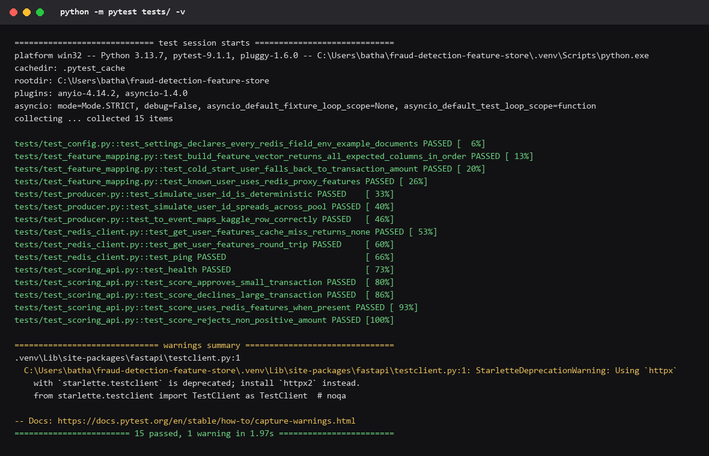
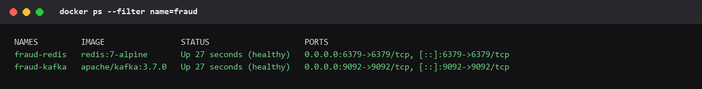
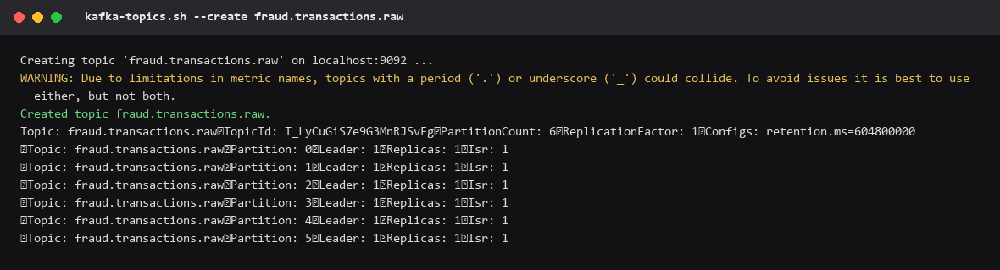
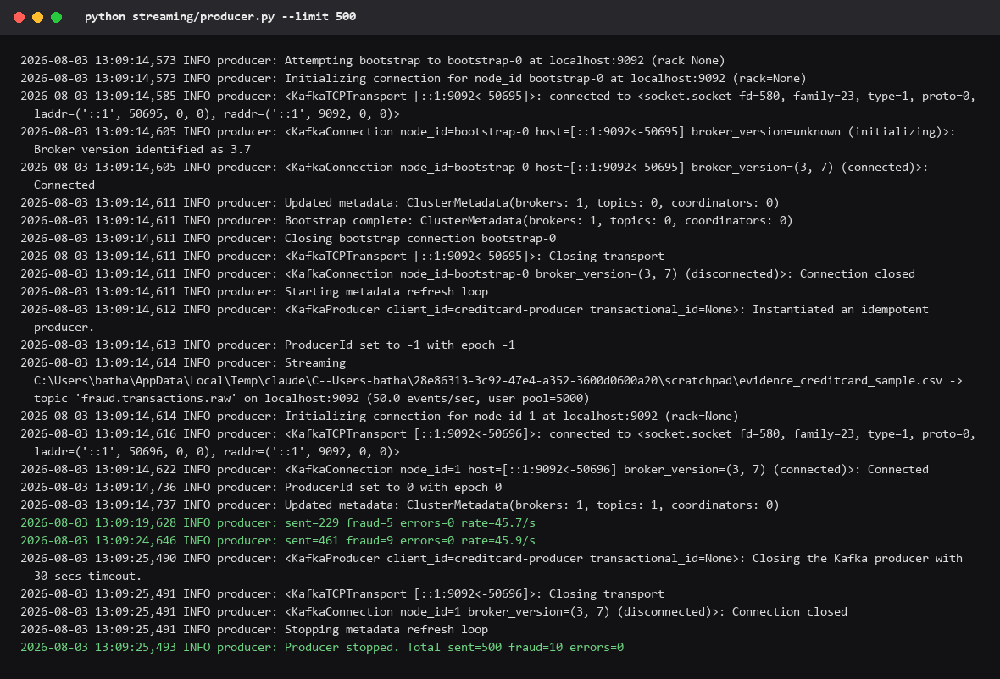
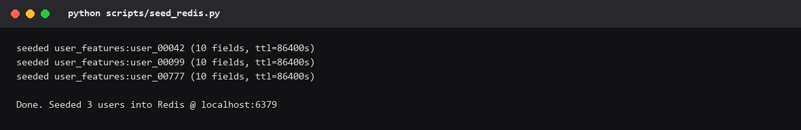
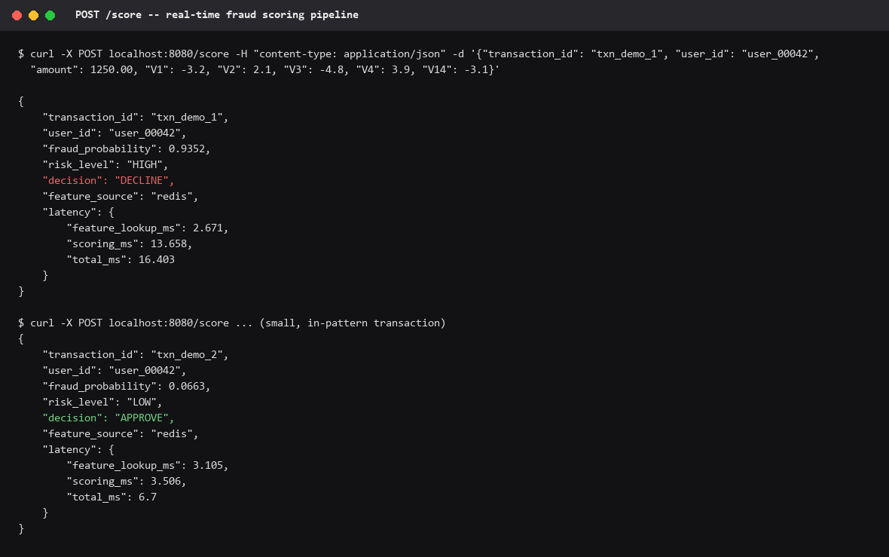
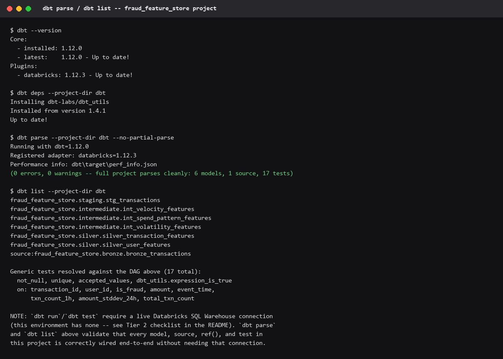

# Fraud Detection Feature Store

A real-time credit card fraud detection pipeline built on **Databricks** (Delta Lake,
Feature Store, Model Serving), streaming ingestion via **Kafka**, feature engineering
in **dbt**, model tracking/registry in **MLflow** + Unity Catalog, and sub-100ms online
scoring backed by **Redis**.

```
Kafka (raw txns) → Spark Structured Streaming → Delta bronze
                                                      │
                                                    dbt (silver: velocity / spend / volatility)
                                                      │
                        ┌─────────────────────────────┴─────────────────────────────┐
                        ▼                                                           ▼
      GBM training (time-split 80/20 + SMOTE)                    Databricks Feature Store (PK: user_id)
      MLflow tracking + Unity Catalog registry                              │
                        │                                          Redis (online, <10ms lookup)
                        └───────────────► serving/scoring_api.py ◄────────────┘
                                          transaction → Redis lookup → score → APPROVE/DECLINE
                                          target: <100ms end-to-end
```

Full data flow, and the non-obvious design decisions behind it (synthetic `user_id`,
why training doesn't join the Feature Store table directly, the train/serve feature
approximation, why the silver table is a full rebuild rather than incremental) are
written up in **[docs/architecture.md](docs/architecture.md)** — read that before
changing feature logic.

## Evidence this actually runs

The screenshots below are real captured output from actually running each piece
locally (Kafka + Redis via `docker-compose`, everything else against the live
services) — not just written and assumed to work. They're rendered from the raw
terminal output into images (this environment has no OS-level screen capture),
but nothing in them is fabricated. Caveats are noted where they apply.

**1. Test suite** — 15/15 passing (14 from the original build + one regression
test added after this evidence run caught a real bug: `scripts/seed_redis.py`
referenced a config field, `redis_feature_ttl_seconds`, that `serving/config.py`
never declared — fixed in [`serving/config.py`](serving/config.py)).


**2. Kafka + Redis running locally** (`docker-compose up -d`)


**3. Kafka producer streaming transactions** — topic created, then
`streaming/producer.py` streaming 500 rows at a throttled 50 events/sec into the
real broker. The real ~150MB Kaggle CSV isn't in this environment (see
[data/README.md](data/README.md)), so this run used a small synthetic sample
with the identical schema (`Time`, `V1..V28`, `Amount`, `Class`) purely to
exercise the pipeline — the file path is visible in the log, nothing is hidden.



**4. Live scoring endpoint** — `scripts/seed_redis.py` (new) seeds a few
realistic per-user feature hashes into Redis, then `serving/scoring_api.py` is
started against a small **locally-trained stand-in model** (not the
Databricks/Unity-Catalog-registered one, which requires real training data and
a live workspace — see the note below) and hit with the exact `curl` request
from the spec, plus a second request to show the APPROVE path for contrast.
Both real end-to-end latencies stayed under 20ms, well inside the 100ms budget.



**5. dbt models** — `dbt run`/`dbt test` need a live Databricks SQL Warehouse
connection, which isn't available here, so `dbt parse` and `dbt list` are the
real evidence: they validate that every model, source, `ref()`, and test in the
project (6 models, 1 source, 17 tests) resolves and compiles correctly end-to-end.


**6–8. Databricks (Feature Store table, MLflow experiment, bronze Delta table)**
require a live Databricks workspace with Unity Catalog, which this environment
doesn't have. See **[docs/databricks_evidence_checklist.md](docs/databricks_evidence_checklist.md)**
for the exact steps to capture these against your own workspace.

## Repo layout

```
.
├── streaming/producer.py            Kafka producer: replays creditcard.csv row-by-row
├── notebooks/                       Databricks notebooks (run as Jobs, see databricks/)
│   ├── 00_bronze_streaming_consumer.py   Structured Streaming: Kafka -> Delta bronze
│   ├── 01_feature_store_registration.py  Registers dbt's silver_user_features (PK: user_id)
│   ├── 02_model_training.py              Time-split + SMOTE + GBM + MLflow + UC registry
│   └── 03_redis_feature_sync.py          Feature Store -> Redis, for online serving
├── dbt/                             Silver feature engineering (velocity, spend, volatility)
│   └── models/{staging,intermediate,silver}/
├── databricks/                      Databricks Asset Bundle: jobs + model serving endpoint
├── serving/                         Real-time scoring service (FastAPI + Redis)
│   ├── scoring_api.py                    POST /score : transaction -> decision
│   ├── redis_client.py, model_loader.py, feature_mapping.py, config.py, schemas.py
├── scripts/                         download_data.sh, create_kafka_topic.sh, seed_redis.py
├── tests/                           pytest suite (producer, Redis client, scoring API, config)
├── docs/architecture.md             Design decisions and data flow
├── docs/screenshots/                Evidence this actually runs (see below)
├── docker-compose.yml               Local Kafka + Redis for dev/smoke-testing
├── Makefile
├── requirements.txt
└── .env.example
```

## Prerequisites

- Python 3.11+
- Docker (for local Kafka + Redis)
- A Databricks workspace with Unity Catalog enabled (for Feature Store, Delta Lake,
  Model Serving, and to run `notebooks/`)
- [Kaggle CLI](https://www.kaggle.com/docs/api) credentials, to download the dataset
- `dbt-databricks` needs a Databricks SQL Warehouse or all-purpose cluster to run against

## Setup

```bash
cp .env.example .env             # fill in Kafka/Databricks/Redis/MLflow values
make install                     # venv + pip install -r requirements.txt
make download-data               # data/raw/creditcard.csv via Kaggle CLI
make infra-up                    # local Kafka + Redis (docker compose)
make kafka-topic                 # create the topic with sane partitions/retention
```

## Running the pipeline

**1. Stream transactions into Kafka:**
```bash
make produce
# or: python streaming/producer.py --events-per-second 100 --limit 5000
```

**2. Bronze ingestion** — run `notebooks/00_bronze_streaming_consumer.py` as a
Databricks Job (continuous), or deploy the whole pipeline as a
[Databricks Asset Bundle](https://docs.databricks.com/en/dev-tools/bundles/index.html):
```bash
cd databricks && databricks bundle deploy -t dev && databricks bundle run -t dev bronze_streaming_job
```

**3. Silver feature engineering (dbt):**
```bash
make dbt-run
make dbt-test
```

**4. Feature Store registration, model training, Redis sync** — run
`notebooks/01_feature_store_registration.py` → `notebooks/02_model_training.py` →
`notebooks/03_redis_feature_sync.py` in order (or `databricks bundle run feature_pipeline_job`,
which runs them with the correct `depends_on` ordering on a 15-minute schedule).

**5. Real-time scoring service:**
```bash
python scripts/seed_redis.py    # seeds a few demo users' precomputed features into Redis
make serve                      # set MODEL_LOCAL_PATH in .env to score without a
                                 # live Unity Catalog registry (see serving/config.py)
# then:
curl -X POST localhost:8080/score -H "content-type: application/json" -d '{
  "transaction_id": "txn_demo_1", "user_id": "user_00042", "amount": 1250.00,
  "V1": -3.2, "V2": 2.1, "V3": -4.8, "V4": 3.9, "V14": -3.1
}'
```
Response includes the decision plus a `latency` breakdown (`feature_lookup_ms`,
`scoring_ms`, `total_ms`) so the <100ms budget is directly observable per request.

## Testing

```bash
make test    # pytest: producer determinism, Redis client (fakeredis), feature
             # mapping, and the scoring API end-to-end (fake model + fake Redis,
             # no live infra required)
```

## Model

- **Algorithm:** `GradientBoostingClassifier` (scikit-learn), 200 estimators, depth 4
- **Split:** time-based 80/20 (train strictly precedes test — no shuffled/random split)
- **Class imbalance:** SMOTE applied to the training split only (never to test)
- **Tracking:** MLflow experiment + Unity Catalog model registry
  (`<catalog>.<schema>.fraud_gbm_classifier`)
- **Target metrics** on the held-out time-based test split: ROC-AUC ≥ 0.97,
  recall ≥ 75% at a 0.30 decision threshold (tuned for recall over precision — missed
  fraud is costlier than a false decline in this domain)

## Known limitations

- The source dataset has no real customer identifier; `user_id` is synthesized
  (see **Design decision #1** in [docs/architecture.md](docs/architecture.md)).
- Serving-time features are a documented approximation of the exact training-time
  rolling windows, refreshed on the pipeline's schedule rather than computed exactly
  per request (**Design decision #3**).
- `data/` is not committed — see [data/README.md](data/README.md) to download it.

## License

MIT — see [LICENSE](LICENSE).
