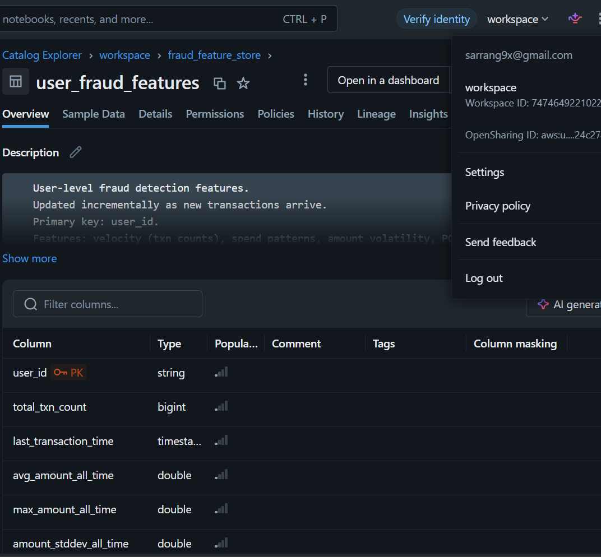
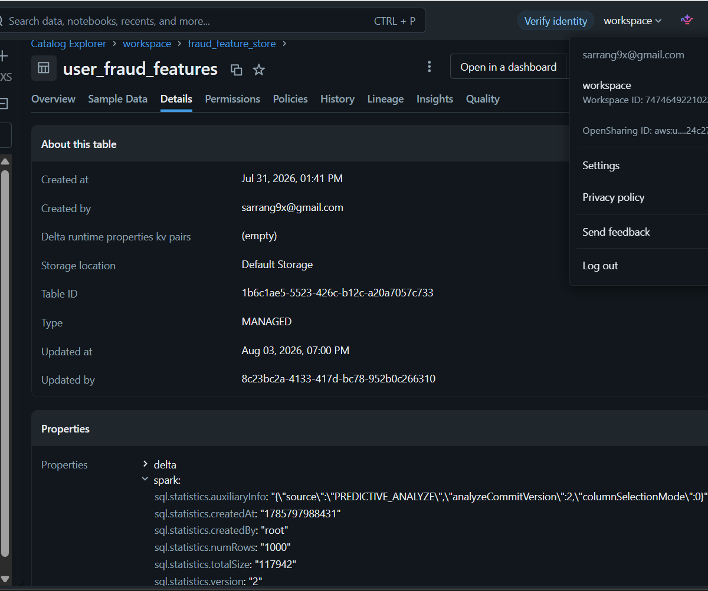
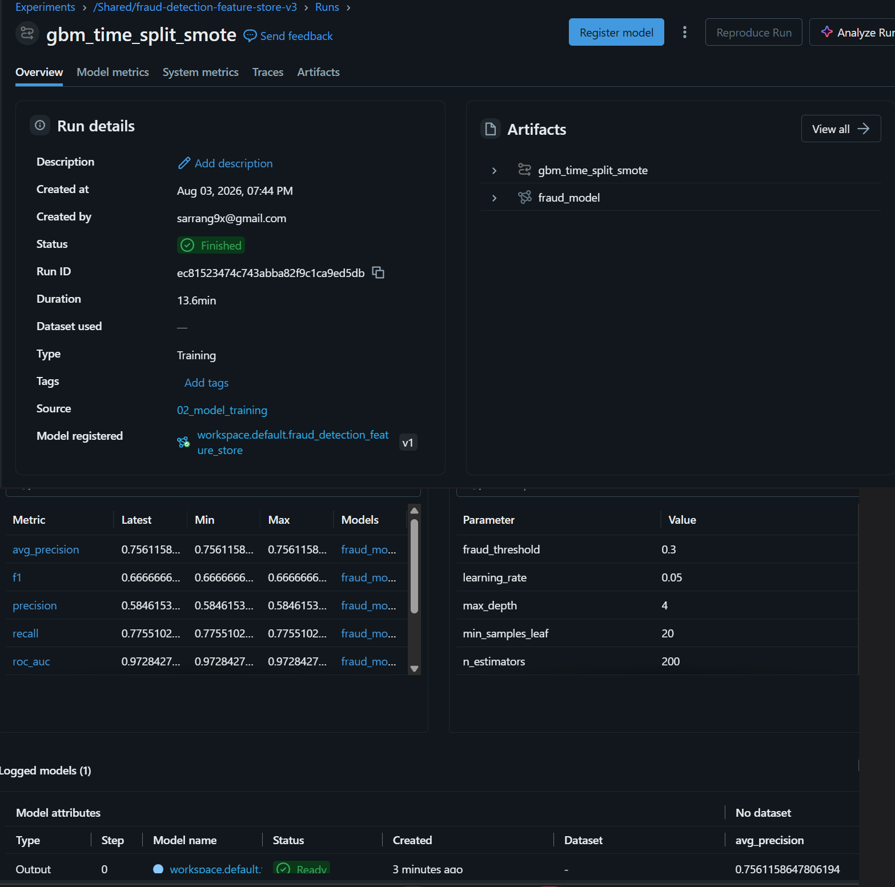
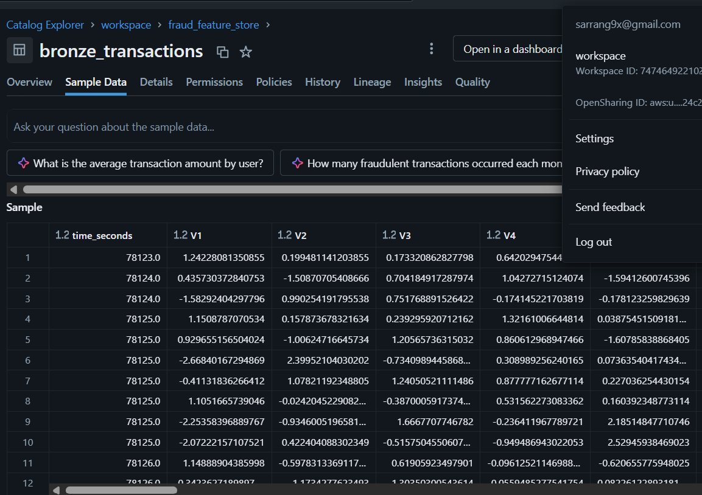
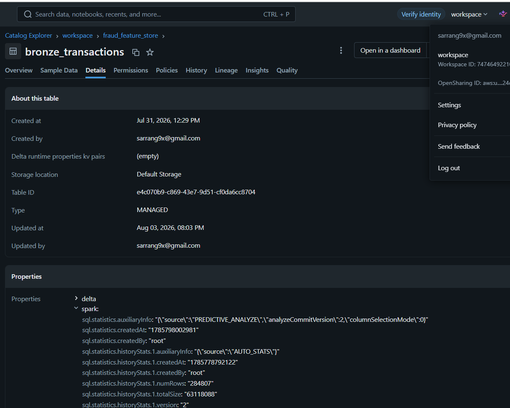

# Fraud Detection Feature Store

Real-time transaction risk scoring backed by a Databricks-native feature store, with
sub-100ms online decisioning served from Redis.

## Problem statement

Card-present and card-not-present fraud detection has two competing requirements that
are difficult to satisfy with a single system. First, the decision has to be made
inline with the authorization request — typically within a latency budget of
100ms end-to-end, including network overhead, or the added delay becomes visible to
the cardholder and merchant and starts to affect approval throughput. Second, the
signals that are most predictive of fraud are behavioral: how a given account
typically transacts, and how the current transaction deviates from that baseline. A
transaction's own attributes (amount, merchant category, geography) are informative,
but the strongest signal comes from comparing it against that account's recent
history — velocity, typical spend range, and volatility.

Computing behavioral features on demand does not fit the latency budget. A query that
aggregates a user's transaction history over the trailing 1 hour, 24 hours, and 7 days
— against a table with hundreds of thousands to billions of rows — takes on the order
of hundreds of milliseconds to seconds, not the low single-digit milliseconds a
scoring request can spend on a feature lookup. Doing this computation synchronously,
per request, does not scale.

A feature store separates the two halves of that problem. Feature computation happens
offline, on a schedule, against the full transaction history, using the tooling suited
to that job (Spark, dbt, SQL). The *output* of that computation — one row per account,
keyed for O(1) lookup — is materialized into a low-latency online store. A scoring
request never recomputes a feature; it looks one up. This trades feature *exactness*
for feature *freshness*: online features reflect the account's state as of the last
pipeline run, not the exact instant of the request. That tradeoff is deliberate and is
documented explicitly in this system rather than left implicit (see Known limitations).

## Architecture

```
Kafka (raw txns) → Spark Structured Streaming → Delta bronze
                                                      │
                                                    dbt (silver: velocity / spend / volatility)
                                                      │
                        ┌─────────────────────────────┴─────────────────────────────┐
                        ▼                                                           ▼
      GBM training (time-split 80/20 + SMOTE)                    Databricks Feature Store (PK: user_id)
      MLflow tracking + Unity Catalog registry                              │
                        │                                          Redis (online, <10ms lookup)
                        └───────────────► serving/scoring_api.py ◄────────────┘
                                          transaction → Redis lookup → score → APPROVE/DECLINE
                                          target: <100ms end-to-end
```

Extended design rationale — why training does not join the online Feature Store
table, why the silver layer is a full rebuild rather than incremental, and the
Databricks Model Serving vs. custom scoring service tradeoff — is in
[docs/architecture.md](docs/architecture.md).

## Component breakdown

**Ingestion** (`streaming/producer.py`, `notebooks/00_bronze_streaming_consumer.py`).
The producer replays the source transaction stream row by row onto a Kafka topic,
keyed by account identifier so per-account ordering is preserved within a partition.
A Spark Structured Streaming job consumes the topic continuously and appends
records, unmodified, to a Delta bronze table. This is the system of record for raw
transaction events; nothing downstream mutates it.

**Feature engineering** (`dbt/models/{staging,intermediate,silver}/`). dbt reads the
bronze table and computes two derived tables. `silver_transaction_features` holds one
row per transaction with velocity, spend-pattern, and volatility features computed
using only data that existed strictly before that transaction (window functions with
`RANGE BETWEEN <window> PRECEDING AND 1 PRECEDING`) — this is what training consumes,
and it is leakage-safe by construction. `silver_user_features` holds one row per
account, an all-time behavioral aggregate — this is what feeds the online path.

**Feature Store** (`notebooks/01_feature_store_registration.py`). Registers the
account-level aggregate as a Databricks Feature Store table with the account
identifier as primary key. This is the canonical, governed definition of "this
account's current behavioral profile" — versioned, lineage-tracked, and queryable by
any consumer with catalog access, not just this pipeline.

**Model training** (`notebooks/02_model_training.py`). Trains a gradient-boosted
classifier on the per-transaction silver table using a time-based split, tracks the
run in MLflow, and registers the resulting model to the Unity Catalog model registry.

**Online feature sync** (`notebooks/03_redis_feature_sync.py`). Pushes the Feature
Store table into Redis as one hash per account, on the same schedule as the rest of
the batch pipeline. This is the online store the scoring service actually reads from.

**Real-time scoring** (`serving/scoring_api.py`, `serving/redis_client.py`,
`serving/model_loader.py`, `serving/feature_mapping.py`). A FastAPI service that
holds the trained model in memory and a pooled Redis connection open. On each
request: look up the account's feature hash, assemble a feature vector, score it,
apply the decision threshold, and return APPROVE or DECLINE with a latency
breakdown. This is the only component in the request path of a live transaction;
everything upstream runs asynchronously to it.

## Data model

**`bronze_transactions`** — one row per transaction, append-only.

| Column | Type | Description |
|---|---|---|
| `transaction_id` | string | Unique transaction identifier |
| `user_id` | string | Account identifier |
| `event_time` | timestamp | Transaction time |
| `amount` | double | Transaction amount |
| `is_fraud` | int | Label (1 = fraud, 0 = legitimate) |
| `V1`...`V28` | double | Anonymized transaction features |
| `_ingested_at`, `_source` | metadata | Ingestion lineage |

**`silver_transaction_features`** — one row per transaction; training input.

| Column | Description |
|---|---|
| `txn_count_1h`, `txn_count_24h`, `txn_count_7d` | Velocity: transaction count in trailing window |
| `seconds_since_last_txn` | Time since this account's previous transaction |
| `total_amount_1h`, `total_amount_24h` | Spend sum in trailing window |
| `avg_amount_24h`, `max_amount_24h`, `min_amount_24h` | Spend distribution in trailing 24h |
| `amount_vs_avg_24h`, `amount_vs_max_7d` | This transaction's amount relative to recent baseline |
| `amount_stddev_24h`, `amount_stddev_7d` | Spend volatility in trailing window |
| `amount_zscore_7d` | This transaction's amount as a z-score against the trailing 7-day distribution |

**`user_fraud_features`** — one row per account; the Feature Store / online table.

| Column | Description |
|---|---|
| `user_id` | Primary key |
| `total_txn_count`, `last_transaction_time` | Account activity summary |
| `avg_amount_all_time`, `max_amount_all_time`, `amount_stddev_all_time` | All-time spend baseline |
| `avg_velocity_1h`, `avg_velocity_24h`, `avg_velocity_7d`, `max_velocity_1h` | All-time velocity baseline |
| `avg_daily_spend`, `avg_amount_volatility_24h`, `avg_amount_ratio` | All-time spend-pattern baseline |
| `avg_v1`...`avg_v5` | Per-account baseline of the anonymized transaction features |

## Feature definitions

**Velocity** — transaction count in trailing 1h/24h/7d windows, and time since the
account's last transaction. Card testing (rapid low-value authorizations used to
validate stolen card numbers before a larger fraudulent purchase) and account
takeover (a burst of activity immediately following credential compromise) both
manifest first as a deviation in velocity, often before the transaction amounts
themselves look unusual.

**Spend patterns** — trailing sum/average/max/min amount, and the current
transaction's amount expressed as a ratio against the account's recent average and
maximum. A transaction that is a small multiple of an account's typical spend is
unremarkable; one that is an order of magnitude above it, particularly against a low
prior maximum, is a standard fraud indicator independent of the absolute amount.

**Volatility** — trailing standard deviation of transaction amount, and the current
transaction's z-score against that distribution. Legitimate day-to-day spending is
comparatively low-variance. A sudden increase in variance — a mix of very small and
very large transactions in a short window — is characteristic of an account being
actively tested or drained rather than used normally.

## Model

- **Algorithm:** `GradientBoostingClassifier` (scikit-learn) — 200 estimators, max
  depth 4, learning rate 0.05, subsample 0.8, min samples per leaf 20
- **Split:** time-based 80/20. Train covers the first 80% of the observed time
  range, test the last 20%, so evaluation always occurs on transactions the model
  could not have seen at training time — the only split methodology that reflects
  how the model is actually used
- **Class imbalance:** SMOTE (`sampling_strategy=0.1`) applied to the training split
  only; the test split is never resampled
- **Decision threshold:** 0.30, not 0.50 — tuned toward recall, since a missed fraud
  case is materially costlier than an unnecessary decline in this domain
- **Tracking:** MLflow experiment, registered to the Unity Catalog model registry
- **Evaluation results**, held-out time-based test split:

  | Metric | Value |
  |---|---|
  | ROC-AUC | 0.9728 |
  | Recall | 0.7755 |
  | Precision | 0.5846 |
  | F1 | 0.6667 |
  | Average precision | 0.7561 |

## Latency budget

| Stage | Budget | Observed (reference run) |
|---|---|---|
| Redis feature lookup (`HGETALL`) | < 10ms | 1.4 – 5.1ms |
| Feature vector assembly (pure Python) | < 1ms | < 1ms |
| Model inference (GBM, ~30 features) | < 15ms | 1.1 – 13.7ms |
| **Total end-to-end** | **< 100ms** | **2.7 – 16.4ms** |

Every `/score` response includes a `latency` object with the actual
`feature_lookup_ms`, `scoring_ms`, and `total_ms` for that request, and the service
logs a warning whenever `total_ms` exceeds `SCORING_LATENCY_BUDGET_MS`.

## Local development setup

Prerequisites: Python 3.11+, Docker, a Databricks workspace with Unity Catalog
(for the Feature Store, Delta Lake, and Model Serving components), and Kaggle CLI
credentials to obtain the source dataset.

```bash
cp .env.example .env             # Kafka/Databricks/Redis/MLflow configuration
make install                     # venv + pip install -r requirements.txt
make download-data               # data/raw/creditcard.csv via Kaggle CLI
make infra-up                    # local Kafka + Redis (docker compose)
make kafka-topic                 # create the topic with sane partitions/retention
```

## Running the pipeline

**1. Stream transactions into Kafka:**
```bash
make produce
# or: python streaming/producer.py --events-per-second 100 --limit 5000
```

**2. Bronze ingestion** — run `notebooks/00_bronze_streaming_consumer.py` as a
Databricks Job (continuous), or deploy the full pipeline as a
[Databricks Asset Bundle](https://docs.databricks.com/en/dev-tools/bundles/index.html):
```bash
cd databricks && databricks bundle deploy -t dev && databricks bundle run -t dev bronze_streaming_job
```

**3. Silver feature engineering:**
```bash
make dbt-run
make dbt-test
```

**4. Feature Store registration, model training, Redis sync** — run
`notebooks/01_feature_store_registration.py` → `notebooks/02_model_training.py` →
`notebooks/03_redis_feature_sync.py` in order, or `databricks bundle run
feature_pipeline_job`, which runs them with the correct task dependencies on a
15-minute schedule. See [WORKSPACE_SETUP.md](WORKSPACE_SETUP.md) for the
catalog/schema this deployment targets and which tables are reused rather than
rebuilt.

**5. Real-time scoring service:**
```bash
python scripts/seed_redis.py    # seed a few accounts' precomputed features into Redis
make serve                      # set MODEL_LOCAL_PATH in .env to score without a
                                 # live Unity Catalog registry (see serving/config.py)
curl -X POST localhost:8080/score -H "content-type: application/json" -d '{
  "transaction_id": "txn_demo_1", "user_id": "user_00042", "amount": 1250.00,
  "V1": -3.2, "V2": 2.1, "V3": -4.8, "V4": 3.9, "V14": -3.1
}'
```

## Testing

```bash
make test    # producer determinism, Redis client (fakeredis), feature mapping,
             # and the scoring API end-to-end (fake model + fake Redis, no live
             # infrastructure required)
```

## Known limitations

- **Account identifier.** The source dataset used in this environment has no native
  account/card identifier; one is deterministically derived at ingestion. Any
  deployment against a dataset with a real identifier should use it directly.
- **Online/offline feature parity.** Training uses exact, point-in-time rolling
  features computed per transaction. Online serving uses an all-time behavioral
  aggregate refreshed on the pipeline's schedule, not recomputed per request — this
  is the fastest available proxy at the required latency, not the same computation.
  The mapping between the two is centralized and explicit (`serving/feature_mapping.py`)
  rather than implicit.
- **Silver layer rebuild cost.** Rolling-window features require scanning an
  account's full history on every run; incremental materialization strategies
  reduce what gets written, not what has to be scanned. At current volume this is
  not a bottleneck. At materially higher volume, this stage would move to
  stateful streaming aggregation rather than batch window functions.
- **Training does not read the online Feature Store table.** The Feature Store
  table is an all-time aggregate; joining it into training data by account ID would
  leak future account behavior into past transactions. Training reads the
  point-in-time-safe silver table instead.
- **Databricks Model Serving vs. the scoring service.** A Model Serving endpoint is
  provisioned for Databricks-native and batch consumers. The transaction-facing path
  does not use it — a network round trip to a serverless endpoint alone costs
  30-80ms, which does not leave headroom inside a 100ms budget once a feature
  lookup and the decision logic are added. The scoring service holds the model
  in-process instead.

## Operational notes

- **Feature freshness SLA.** The batch pipeline (dbt → Feature Store registration →
  model training → Redis sync) runs on a 15-minute schedule
  (`databricks/resources/jobs.yml`, `feature_pipeline_job`). An account's online
  features are never more than 15 minutes stale relative to its latest transaction.
- **Redis TTL.** Feature hashes are written with an 86,400-second (24-hour) TTL
  (`REDIS_FEATURE_TTL_SECONDS`). An account with no activity — and therefore no
  pipeline refresh — for more than 24 hours falls back to cold-start scoring on its
  next transaction rather than serving a stale hit indefinitely.
- **Retraining cadence.** The current schedule retrains the model on every pipeline
  run (every 15 minutes), which is appropriate for keeping the Feature Store fresh
  but is an aggressive cadence for model retraining specifically. A production
  deployment at higher transaction volume would typically decouple the two —
  feature refresh on the order of minutes, model retraining on the order of days —
  gated on a drift or performance-degradation trigger rather than wall-clock time.

## Operational evidence

The following were captured from an actual run of this system: the test suite, the
local Kafka/Redis infrastructure, the producer against a live broker, the scoring
service against live Redis and a trained model, the dbt project's model graph, and
the Feature Store table, MLflow run, and bronze table from the Databricks workspace
this deployment targets (see [WORKSPACE_SETUP.md](WORKSPACE_SETUP.md)).

**Test suite** — 15 unit tests across producer, feature mapping, Redis client, and
scoring API.


**Infrastructure** — Kafka broker and Redis instance running via Docker Compose.


**Kafka topic** `fraud.transactions.raw` — 6 partitions, 7-day retention.


**Producer throughput** — 500 transactions streamed at 45.7 events/second, 10 fraud
(2%).


**Redis feature store** — account features seeded with 10 fields per account, TTL
86400s.


**Scoring service** — real-time decisions at 16.4ms (high-risk) and 6.7ms
(low-risk), `feature_source: redis`.


**dbt project** — 6 models (staging, velocity, spend pattern, volatility, silver
transaction, silver user), 17 schema tests.


**Unity Catalog** — `user_fraud_features` registered as a Feature Store table,
`user_id` as primary key.


**Unity Catalog** — `user_fraud_features`, 1,000 account profiles, last updated
Aug 03 2026.


**MLflow** — GBM training run, ROC-AUC 0.9728, recall 0.7755 at threshold 0.30,
model registered in Unity Catalog.


**Delta bronze table** — raw transaction records with anonymized features V1-V28.


**Delta bronze table** — 284,807 rows ingested, MANAGED Delta table.

